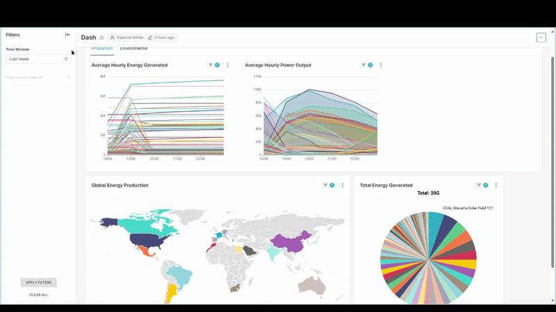

# Solar Farm MQTT Simulator

A comprehensive Python-based simulator that generates realistic telemetry data for 150 solar farms worldwide and publishes it to an MQTT broker. This project simulates real-world solar farm operations including power generation, environmental conditions, system faults, and maintenance cycles. 

To further extend the application's capabilities, a dedicated data transmission service periodically retrieves telemetry from InfluxDB and forwards it to Google BigQuery. This integration facilitates advanced data analysis and business intelligence, enabling the creation of comprehensive visualizations in tools like Apache Superset. An example dashboard is showcased below, demonstrating the potential for in-depth operational insights.

## Features

- **150 Simulated Solar Farms**: Distributed across 23 countries with realistic geographic locations
- **Realistic Data Generation**: 
  - Solar irradiance based on time of day and location
  - Temperature variations (ambient and module)
  - Power output calculations with efficiency factors
  - Energy generation, utilization, and export tracking
- **Fault Simulation**: Random system faults, inverter issues, and string failures
- **Maintenance Cycles**: Automatic maintenance mode simulation
- **MQTT Publishing**: Real-time data streaming to MQTT broker
- **Configurable Parameters**: Easy customization via configuration files
- **InfluxDB v2 Integration**: Modern time-series database with Flux query language
- **Built-in Web UI**: InfluxDB v2 includes a comprehensive web interface

## Architecture

```
Solar Farm Simulator → MQTT Broker → Telegraf → InfluxDB v2 → Grafana
                                   ↘ MQTT Explorer (Web UI)
                                   ↘ InfluxDB Web UI

InfluxDB v2 → BigQuery (via BigQuery Transmitter) → Superset Dashboard
```

## Project Structure

```
solar-farms/
├── solar_farm_simulator.py    # Main simulator application
├── mqtt_subscriber.py         # Test subscriber for monitoring data
├── config.json               # Configuration settings
├── requirements.txt          # Python dependencies
├── docker-compose.yml        # Complete monitoring stack (InfluxDB v2)
├── mosquitto.conf           # MQTT broker configuration
├── telegraf.conf            # Telegraf data collection config (v2 format)
├── grafana/                 # Grafana configuration
│   ├── provisioning/        # Auto-provisioning configs (InfluxDB v2)
│   └── dashboards/          # Pre-built dashboards
├── influxdb2-init/          # InfluxDB v2 initialization scripts
├── static.json              # Static data template
├── telemetry.json           # Telemetry data template
├── setup.sh / setup.ps1     # Cross-platform setup scripts
├── test_simulator.py        # Test suite
├── INFLUXDB_V2_MIGRATION.md # InfluxDB v2 migration guide
├── FLUX_QUERIES.md          # Flux query examples
└── README.md               # This file
```

## Quick Start

### 1. Install Dependencies

```bash
pip install -r requirements.txt
```

### 2. Start the Complete Stack

**Linux/Mac:**
```bash
./setup.sh
```

**Windows:**
```powershell
.\setup.ps1
```

**Manual Start:**
```bash
docker-compose up -d
```

### 3. Run the Solar Farm Simulator

```bash
python solar_farm_simulator.py
```

## Services and Access Points

After running the setup script, the following services will be available:

- **MQTT Broker**: `localhost:1883` (Eclipse Mosquitto)
- **InfluxDB v2**: `localhost:8086` (admin/admin123456)
- **InfluxDB Web UI**: `http://localhost:8086`
- **Grafana**: `http://localhost:3000` (admin/admin123)
- **MQTT Explorer**: `http://localhost:4000`

## InfluxDB v2 Configuration

### Organization and Buckets
- **Organization**: `solar-farms`
- **Main Bucket**: `solar_farms` (30 days retention)
- **Additional Buckets**:
  - `solar_farms_realtime` (7 days) - High-frequency data
  - `solar_farms_historical` (1 year) - Long-term aggregated data
  - `solar_farms_events` (6 months) - Faults and maintenance

### Authentication
- **Admin Token**: `solar-farms-admin-token-super-secret-12345`
- **Additional tokens** created for different access levels (read-only, write-only, telegraf)

### View Tokens
```bash
docker exec influxdb cat /tmp/influxdb-tokens.txt
```

## Data Structure

### MQTT Topics

The simulator publishes data to the following MQTT topics:

- `solar_farms/{site_id}/static` - Static farm information
- `solar_farms/{site_id}/telemetry` - Real-time operational data
- `solar_farms/{site_id}/faults` - System fault information
- `solar_farms/{site_id}/maintenance` - Maintenance status
- `solar_farms/{site_id}/weather` - Weather conditions

### InfluxDB v2 Measurements

Data is stored in InfluxDB v2 with the following measurements:

- `solar_farm_static` - Farm configuration and location data
- `solar_farm_telemetry` - Power generation and system metrics
- `solar_farm_faults` - Fault events and system issues
- `solar_farm_maintenance` - Maintenance schedules and status
- `solar_farm_weather` - Environmental conditions

## Querying Data

### InfluxDB v2 Web UI
Access the built-in web interface at `http://localhost:8086` to:
- Explore data with the Data Explorer
- Write and test Flux queries
- Create custom dashboards
- Manage buckets and tokens

### Flux Query Examples

See `FLUX_QUERIES.md` for comprehensive examples. Basic query:

```flux
from(bucket: "solar_farms")
  |> range(start: -1h)
  |> filter(fn: (r) => r._measurement == "solar_farm_telemetry")
  |> filter(fn: (r) => r._field == "power_output")
```

### Python Client

```python
from influxdb_client import InfluxDBClient

client = InfluxDBClient(
    url="http://localhost:8086",
    token="solar-farms-admin-token-super-secret-12345",
    org="solar-farms"
)

query_api = client.query_api()
query = '''
from(bucket: "solar_farms")
  |> range(start: -1h)
  |> filter(fn: (r) => r._measurement == "solar_farm_telemetry")
'''
result = query_api.query(query)
```

## Configuration

### Simulator Configuration (`config.json`)

```json
{
  "mqtt": {
    "broker": "localhost",
    "port": 1883,
    "keepalive": 60
  },
  "simulation": {
    "update_interval": 30,
    "fault_probability": 0.001,
    "maintenance_probability": 0.0001
  }
}
```

### Farm Data Templates

- `static.json` - Template for static farm information
- `telemetry.json` - Template for telemetry data structure

## Monitoring and Visualization

### Grafana Dashboards

Pre-configured dashboards include:
- Solar Farm Overview
- Power Generation Analysis
- Fault Monitoring
- Environmental Conditions
- Maintenance Tracking

### MQTT Explorer

Web-based MQTT client for real-time message monitoring at `http://localhost:4000`.

### BI Dashboard with Superset
Superset provides advanced analytics and visualization capabilities for the solar farm data, enabling insights into power generation and environmental conditions. An example of teh data that has been published can be found at: 
[Superset Dashboard](http://superset.grant-campbell.work/superset/dashboard/1/)

Login credentials are: user/user



## Development and Testing

### Running Tests

```bash
python test_simulator.py
```

### MQTT Subscriber for Testing

```bash
python mqtt_subscriber.py
```

### Health Check

```bash
python health_check.py
```

## Troubleshooting

### Common Issues

1. **InfluxDB not starting**: Check Docker logs and ensure ports are available
2. **Telegraf connection issues**: Verify MQTT broker is running and accessible
3. **Grafana datasource errors**: Check InfluxDB v2 token and organization settings
4. **No data in dashboards**: Ensure simulator is running and publishing data

### Useful Commands

```bash
# Check service status
docker-compose ps

# View logs
docker logs influxdb
docker logs solar-farm-telegraf
docker logs solar-farm-grafana

# Restart services
docker-compose restart

# View InfluxDB tokens
docker exec influxdb cat /tmp/influxdb-tokens.txt
```

## Migration from InfluxDB v1

If you're upgrading from a previous version using InfluxDB v1, see `INFLUXDB_V2_MIGRATION.md` for detailed migration instructions and `INFLUXDB_V1_BACKUP.md` for rollback procedures.

## Security Considerations

- Change default passwords and tokens in production
- Use environment variables for sensitive configuration
- Implement proper network security (firewalls, VPNs)
- Enable TLS for production deployments
- Regularly rotate authentication tokens

## Performance Optimization

- Adjust Telegraf batch sizes for your data volume
- Configure appropriate retention policies for different data types
- Use downsampling for long-term historical data
- Monitor resource usage and scale containers as needed

## Contributing

1. Fork the repository
2. Create a feature branch
3. Make your changes
4. Add tests for new functionality
5. Submit a pull request

## License

This project is licensed under the MIT License - see the LICENSE file for details.

## Support

For issues and questions:
1. Check the troubleshooting section
2. Review the migration guide for InfluxDB v2 specific issues
3. Check Docker container logs
4. Create an issue in the repository